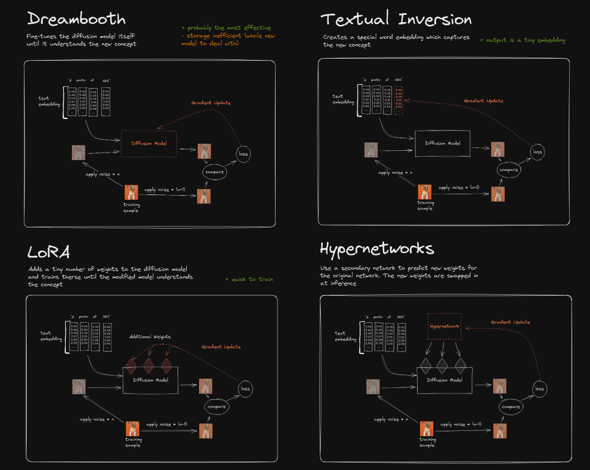
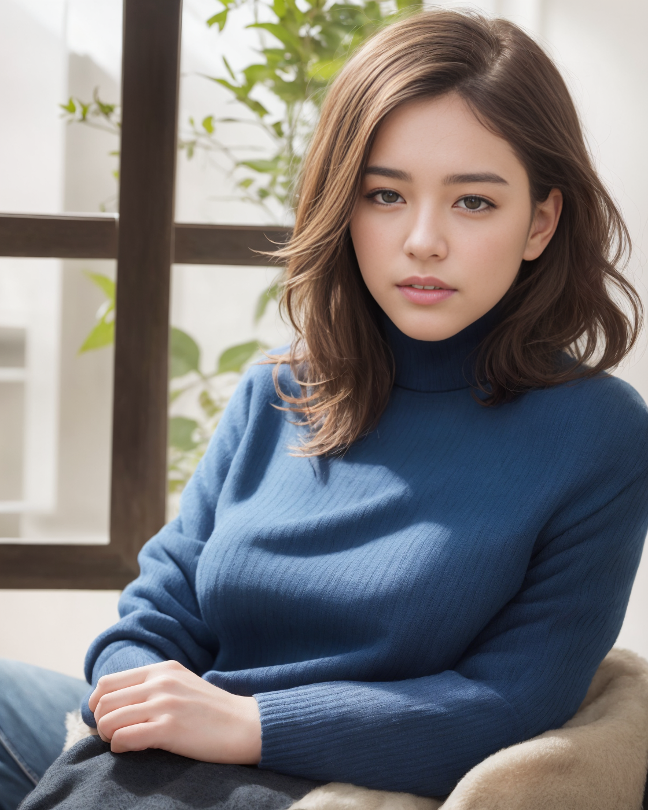

# 1 Fine-Tune methods for Stable Diffusion
[LORA模型训练叠加controlnet](https://mp.weixin.qq.com/s/laOQ6udr87gVNsxgMvI7SA "LORA模型训练叠加controlnet")


# 2 To install SD WebUI
[AUTOMATIC1111 SD WebUI](https://github.com/AUTOMATIC1111/stable-diffusion-webui) 
## 2.1 安装过程注意事项
	1. 创建一个python 3.10的环境  （venv会复制这个环境，然后xformers会依赖python 3.10）
	2. 在 webui-user.sh 中添加 export COMMANDLINE_ARGS="--xformers --share --listen --enable-insecure-extension-access --no-half-vae"
		--xformers 依赖会加速图片生成
		--share 会生成一个类似 https://4b3cc8ca-8d33-42ed.gradio.live 的公开链接，可以公网访问
		--listen 会生成 http://0.0.0.0:7860 使得可以连接到这个机器的其他机器通过IP来访问
		--enable-insecure-extension-access 会让extension的访问正常 见module.shared.py 文件
		--no-half-vae 会解决VAE出现的NaNs问题
	3. 关于安装路径的问题，可以在webui-user.sh中 设置 install_dir；另外，先clone下来stable-diffusion-webui 的repo，运行webui.sh会自动将整个安装放在webui.sh所在路径下
        如果用官网的安装指令 bash <(wget -qO- https://raw.githubusercontent.com/AUTOMATIC1111/stable-diffusion-webui/master/webui.sh)， 会默认安装在/home/$(whoami)/stable-diffusion-webui/下 
    4. 安装完后直接运行 ./webui.sh 即可

## 2.2 Errors & Bugs
__modules.devices.NansException: A tensor with all NaNs was produced in VAE. This could be because there's not enough precision to represent the picture. Try adding --no-half-vae commandline argument to fix this. Use --disable-nan-check commandline argument to disable this check.__  
解决办法：在 webui-user.sh 中添加 `export COMMANDLINE_ARGS="--xformers --share --listen --enable-insecure-extension-access --no-half-vae"`

# 3 利用 tex2img 来生成图片
```
[:(highly detail face: 1.2):0.1], (8k, RAW photo, best quality, masterpiece:1.2), (realistic, photo-realistic:1.37), best quality, HDR, cinematic lighting, natural lighting, 1girl, <lora:cutedoll_v71:0.1>, (pureerosface_v1:0.4), black hair, wavy hair, messy hair, wearing tight turtleneck sweater with sleeves, denim pants, indoors, sitting, (head rest), looking at viewer
Negative prompt: (disfigured), weird hands, broken fingers, extra fingers, missing fingers, mutated hands, (deformed hands:1.5), (fewer fingers, extra fingers), (worst quality, low quality:1.4), illustration, 3d, sepia, painting, cartoons, sketch, lowres, bad anatomy, bad hands, normal quality, ((monochrome)), ((grayscale:1.2)), collapsed eyeshadow, multiple eyebrows, vaginas in breasts, pink hair, holes on breasts, stretched nipples, gigantic penis, nipples on buttocks, analog, analog photo, anal sex, signature, logo, 2 faces, hat, cap, nsfw, (necklace:1.5), deformed fingers, extra digits, fewer digits, ((disfigured)), blurry, EasyNegative, nsfw, nude, naked, loli, kid, child, teen, hair between eyes,
Steps: 40, Sampler: DPM++ SDE Karras, CFG scale: 7, Seed: 1692569686, Face restoration: CodeFormer, Size: 560x700, Model hash: fc2511737a, Model: chilloutmix_NiPrunedFp32Fix, Denoising strength: 0.6, Clip skip: 2, Hires upscale: 2, Hires steps: 25, Hires upscaler: Latent (nearest-exact)
```
生成的图片如下： 

