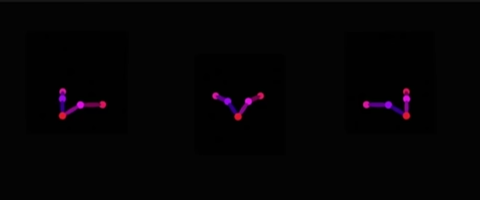

# 试验过程1 text2img + 骨骼图 + LoRA：charturnerbetaLora_charturnbetalora

## 原理
利用SD的text2img功能加上谷歌图做OpenPose的ControlNet约束，charturner LoRA模型做多视角的一致性约束

## 需要安装的插件

ControlNet的插件：sd-webui-controlnet  
Lora的插件：Lora  
提示词括号的支持：prompt-bracket-checker

## 需要下载的模型权重、LoRA权重和Textual Inversion权重
- Base Model: anythingV3_fp16  
- LoRA Model: charturnerbetaLora_charturnbetalora
- Textual Inversion: NULL  

## 骨骼图片及ControlNet设置
骨骼图片：  
  
ControlNet设置：  


## Prompt及对应结果
Prompt：
```
masterpiece, best quality, 1girl, simple background, (white background:1.5), multiple views,
thighhighs, gloves, bow-shaped hair, bare shoulders, shorts, navel, cleavage, long hair, bow, pink hair, bangs, purple eyes，
<lora:charturnerbetaLora_charturnbetalora:0.2>
Negative prompt: lowres, bad anatomy, bad hands, text, error, missing fingers, extra digit, fewer digits, cropped, worst quality, low quality, normal quality, jpeg artifacts, signature, watermark, username, blurry
Steps: 30, Sampler: DPM++ 2M Karras, CFG scale: 7, Seed: 2541653594, Size: 704x320, Model hash: 812cd9f9d9, Model: anythingV3_fp16, Denoising strength: 0.5, ControlNet Enabled: True, ControlNet Module: none, ControlNet Model: control_openpose-fp16 [9ca67cc5], ControlNet Weight: 1, ControlNet Guidance Start: 0, ControlNet Guidance End: 1, Hires upscale: 2, Hires upscaler: Latent
```
CFG Scale：7  
Denoising strength：0.5  
Seed：2541653594  
Result：  

Prompt：
```
masterpiece, best quality, 1girl, simple background, (white background:1.5), multiple views,
thighhighs, gloves, bow-shaped hair, bare shoulders, shorts, navel, cleavage, long hair, bow, pink hair, bangs, purple eyes，
<lora:charturnerbetaLora_charturnbetalora:0.2>
Negative prompt: lowres, bad anatomy, bad hands, text, error, missing fingers, extra digit, fewer digits, cropped, worst quality, low quality, normal quality, jpeg artifacts, signature, watermark, username, blurry
Steps: 30, Sampler: DPM++ 2M Karras, CFG scale: 7, Seed: 3637246925, Size: 704x320, Model hash: 812cd9f9d9, Model: anythingV3_fp16, Denoising strength: 0.6, ControlNet Enabled: True, ControlNet Module: none, ControlNet Model: control_openpose-fp16 [9ca67cc5], ControlNet Weight: 1, ControlNet Guidance Start: 0, ControlNet Guidance End: 1, Hires upscale: 2, Hires upscaler: Latent
```
CFG Scale：7  
Denoising strength：0.6  
Seed：3637246925  
Result：  


## 需要注意和调试的参数
最主要的参数是：  
- CFG Scale：影响提示词对整体图像效果的影响程度，值越小越creative，值越大越固定到prompt
- Denoising strength：影响算法影响程度，0表示图片无变化，1表示图片无关，0~1之间，算法执行的实际步数会小于Sampling steps设定的值  

其他也有影响的参数：
- Sampling method：采样方法
- Sampling steps：采样步数
- Width & Height：图片宽高有时候也会影响结果
- Seed：随机数种子


# 试验过程2 text2img + 骨骼图 + LoRA：charturnerbetaLora_charturnbetalora + Textual Inversion: charturnerv2

## 原理
利用SD的text2img功能加上谷歌图做OpenPose的ControlNet约束，charturner LoRA模型和Textual Inversion做多视角的一致性约束

## 需要安装的插件
同上

## 需要下载的模型权重、LoRA权重和Textual Inversion权重
- Base Model: anythingV3_fp16  
- LoRA Model: charturnerbetaLora_charturnbetalora
- Textual Inversion: charturnerv2  

## 设置及对应结果
骨骼图片：  
  
ControlNet设置：  
  
Prompt：
```
((photo realistic)), master piece, best quality, 1 girl, solo, black hair, ((singe ponytail:1.3)), Chinese ancient, (((white background:1.5))), (charturnerv2:1.3), (multiple views:1.3), ((of the same character in the same outfit)), middle parting hairstyle, <lora:charturnerbetaLora_charturnbetalora:0.2>
Negative prompt: nsfw, ((worst quality, low quality, extra digits:1.4))
Steps: 30, Sampler: DPM++ 2M Karras, CFG scale: 7, Seed: 271156872, Size: 480x200, Model hash: 812cd9f9d9, Model: anythingV3_fp16, Denoising strength: 0.8, ControlNet Enabled: True, ControlNet Module: none, ControlNet Model: control_openpose-fp16 [9ca67cc5], ControlNet Weight: 1, ControlNet Guidance Start: 0, ControlNet Guidance End: 1, Hires upscale: 2, Hires upscaler: Latent
```
Used embeddings: charturnerv2 [9612]  

CFG Scale：7  
Denoising strength：0.8  
Seed：271156872  
Result：  


骨骼图片：  
  
ControlNet设置：  
  
Prompt：
```
((photo realistic)), master piece, best quality, 1 girl, solo, black hair, ((singe ponytail:1.3)), Chinese ancient, (((white background:1.5))), (charturnerv2:1.3), (multiple views:1.3), ((of the same character in the same outfit)), middle parting hairstyle, <lora:charturnerbetaLora_charturnbetalora:0.3>
Negative prompt: nsfw, ((worst quality, low quality, extra digits:1.4))
Steps: 30, Sampler: DPM++ 2M Karras, CFG scale: 7, Seed: 1596857508, Size: 709x208, Model hash: 812cd9f9d9, Model: anythingV3_fp16, Denoising strength: 0.6, ControlNet Enabled: True, ControlNet Module: none, ControlNet Model: control_openpose-fp16 [9ca67cc5], ControlNet Weight: 1, ControlNet Guidance Start: 0, ControlNet Guidance End: 1, Hires upscale: 2, Hires upscaler: Latent
```
Used embeddings: charturnerv2 [9612]   

CFG Scale：7  
Denoising strength：0.6  
Seed：1596857508  
Result：  


## 需要注意和调试的参数
最主要的参数是：  
- CFG Scale：影响提示词对整体图像效果的影响程度，值越小越creative，值越大越固定到prompt
- Denoising strength：影响算法影响程度，0表示图片无变化，1表示图片无关，0~1之间，算法执行的实际步数会小于Sampling steps设定的值  

其他也有影响的参数：
- Sampling method：采样方法
- Sampling steps：采样步数
- Width & Height：图片宽高有时候也会影响结果
- Seed：随机数种子


# 试验过程3 img2img

## 原理
利用SD的img2img功能加上原始图片多视角的一致性来做内容约束

## 需要安装的插件
同上

## 需要下载的模型权重、LoRA权重和Textual Inversion权重
- Base Model: anythingV3_fp16  
- LoRA Model: NULL
- Textual Inversion: NULL  

## 设置及对应结果
输入图片：  
  
无需ControlNet约束  
Prompt：
```
a dynamic series of drawings showing a pink haired and yellow eyed warrior girl, drawing character sheet, pose reference, drawings of the same character at different angles, in 6 poses. 8k,high quality, high resolution, 4k, hd, (well designed face), amazing face, (super detailed), beautiful eyes, [semi realistic 3d]
Negative prompt: (incomplete face), (scribble),((poorly drawn face)),((different faces, different characters, more than one character)), (((disfigured))), dead,((blurry)), (((incorrect))),disconnected limbs,((((mutated hands and fingers)))), missing limbs,(((fake leg))), (body merged),((floating)),((((discontinuous fingers)))), (((low quality))) ,(((amateur work))), disjointed, ((ugly)), out of frame, overexposed, underexposed, contortionist, contorted limbs, hibiscus
Steps: 30, Sampler: DPM++ SDE Karras, CFG scale: 15, Seed: 3681444200, Size: 720x500, Model hash: 812cd9f9d9, Model: anythingV3_fp16, Denoising strength: 0.6, Mask blur: 4
```

CFG Scale：15  
Denoising strength：0.6  
Seed：3681444200  
Result：  


## 需要注意和调试的参数
最主要的参数是：  
- CFG Scale：影响提示词对整体图像效果的影响程度，值越小越creative，值越大越固定到prompt
- Denoising strength：影响算法影响程度，0表示图片无变化，1表示图片无关，0~1之间，算法执行的实际步数会小于Sampling steps设定的值  

其他也有影响的参数：
- Sampling method：采样方法
- Sampling steps：采样步数
- Width & Height：图片宽高有时候也会影响结果
- Seed：随机数种子