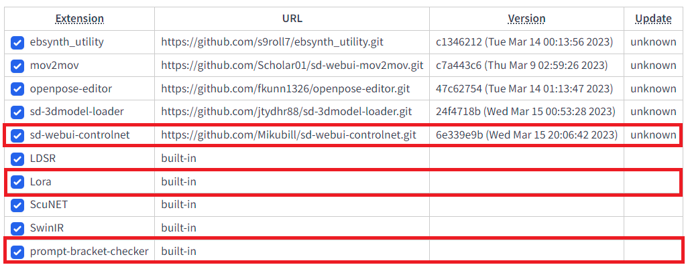
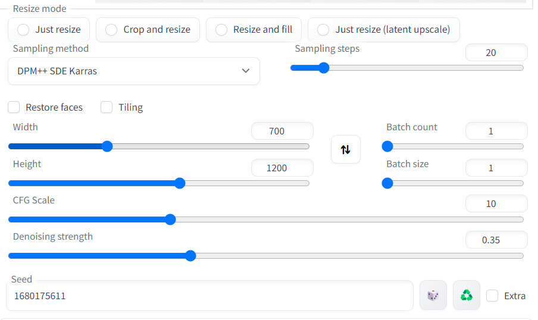

# 下载原始视频并进行图片抽取
## 1. 下载视频
从抖音或者其他网站下载想转换的视频。  
Ref:   
[抖音](https://www.douyin.com/)   
[抖音下载](https://dlpanda.com/)  

## 2. 视频图片抽帧
整个视频都进行处理的话时间会特别长，选取自己想要的视频段转化为图片  

```python
import cv2

input_video = r'3.mp4'
output_dir = r'./images/'

start_time = 4
end_time = 7

vidcap = cv2.VideoCapture(input_video)

fps = int(vidcap.get(cv2.CAP_PROP_FPS))
print("fps: ", fps)

frame2start = start_time * fps
frame2stop = end_time * fps

vidcap.set(cv2.CAP_PROP_POS_FRAMES, frame2start)
print(vidcap.get(cv2.CAP_PROP_POS_FRAMES))

count = frame2start
success, image = vidcap.read()
while success and count <= frame2stop:
    save_path = output_dir + str(count) + ".png"
    cv2.imwrite(save_path, image)
    
    success, image = vidcap.read()
    count += 1
    
print("end!")
```
## 3.视频示例
[original video](Resources/download.mp4)  
<video id="video" controls="" preload="none" poster="">
      <source id="mp4" src="./Resources/download.mp4" type="video/mp4">
</video>  

[clipped video](Resources/in_3s.mp4)  
<video id="video" controls="" preload="none" poster="">
      <source id="mp4" src="./Resources/in_3s.mp4" type="video/mp4">
</video>


# 试验过程 - 原生img2img
## 原理
利用SD的img2img功能处理抽取出的每一帧，然后合成视频；暂时没有进行视频闪烁的处理

## 需要安装的插件

ControlNet的插件：sd-webui-controlnet  
Lora的插件：Lora  
提示词括号的支持：prompt-bracket-checker


## 需要下载的模型权重、LoRA权重和Textual Inversion权重
- Base Model: chilloutmix_NiPrunedFp32Fix  
- LoRA Model: taiwanDollLikeness_v10, cutedoll_v71, koreandolllikeness_V10  
- Textual Inversion: NULL  

## Prompt
```
(8k, RAW photo, best quality, masterpiece:1.2), (realistic, photo-realistic:1.37), ((like D.va in overwatch)), 1girl, (aegyo sal:1), ((wholebody blue bodysuit with pink ornament:1.2)), ((cyberpunk headphones)), portrait, cute, slim, ((white loose trousers connected with the loose blue bodysuit:1.4)), white gloves, ulzzang-6500, <lora:taiwanDollLikeness_v10:0.2>, <lora:cutedoll_v71:0.1>, <lora:koreandolllikeness_V10:0.7>, (Kpop, idol), top view, video game, small bust, dva, corneo, (((D.va))))
Negative prompt: EasyNegative, paintings, sketches, (worst quality:2), (low quality:2), (normal quality:2), lowres, normal quality, ((monochrome)), ((grayscale)), skin spots, acnes, skin blemishes, age spot, glans, extra fingers, fewer fingers, strange fingers, broken fingers, bad hand, ((zettai ryouiki:1.2)), (bared leg:1.2), ng_deepnegative_v1_75t, nsfw, nude, naked, nipples, (large bust:1.5), (bared bust:1.5) underwear, loli, kid, child, teen
Steps: 20, Sampler: DPM++ SDE Karras, CFG scale: 10, Seed: 1680175611, Size: 700x1200, Model hash: fc2511737a, Model: chilloutmix_NiPrunedFp32Fix, Denoising strength: 0.35, Mask blur: 4, ControlNet Enabled: True, ControlNet Module: openpose, ControlNet Model: control_openpose-fp16 [9ca67cc5], ControlNet Weight: 1, ControlNet Guidance Start: 0, ControlNet Guidance End: 1
```

## 需要注意和调试的参数

最主要的参数是：  
- CFG Scale：影响提示词对整体图像效果的影响程度，值越小越creative，值越大越固定到prompt
- Denoising strength：影响算法影响程度，0表示图片无变化，1表示图片无关，0~1之间，算法执行的实际步数会小于Sampling steps设定的值  

其他也有影响的参数：
- Sampling method：采样方法
- Sampling steps：采样步数
- Width & Height：图片宽高有时候也会影响结果
- Seed：随机数种子

## 多帧图片合成视频指令
```bash
ffmpeg -f image2 -r 30 -start_number 120 -i img_path/%d.png -vcodec libx264 -pix_fmt yuv420p out.mp4
```

## 结果
CFG Scale：10  
Denoising strength：0.35  
Seed：1680175611  
[result 1](Resources/out_10_0.35_1680175611_3s_merge.mp4)  
<video id="video" controls="" preload="none" poster="">
      <source id="mp4" src="./Resources/out_10_0.35_1680175611_3s_merge.mp4" type="video/mp4">
</video>  

CFG Scale：10  
Denoising strength：0.4  
Seed：1680175611  
[result 2](Resources/out_10_0.4_1680175611_3s_merge.mp4)  
<video id="video" controls="" preload="none" poster="">
      <source id="mp4" src="./Resources/out_10_0.4_1680175611_3s_merge.mp4" type="video/mp4">
</video>  

CFG Scale：10  
Denoising strength：0.45  
Seed：1680175611  
[result 3](Resources/out_10_0.45_1680175611_3s_merge.mp4)  
<video id="video" controls="" preload="none" poster="">
      <source id="mp4" src="./Resources/out_10_0.45_1680175611_3s_merge.mp4" type="video/mp4">
</video>


# 试验过程 - img2img+ebsynth
stage_index : 7
project_dir : /home/nvidia/workspace/keddyj/EbSynth-Test2
original_movie_path : /tmp/in_3skt9qcyx4.mp4
frame_width : -1
frame_height : -1
st1_masking_method_index : 1
st1_mask_threshold : 0
tb_use_fast_mode : False
tb_use_jit : True
clipseg_mask_prompt : girl, human, foreground, head, face, hair, body, headwear
clipseg_exclude_prompt : finger, hand
clipseg_mask_threshold : 0.2
clipseg_mask_blur_size : 3
clipseg_mask_blur_size2 : 3
key_min_gap : 10
key_max_gap : 300
key_th : 8.5
key_add_last_frame : True
color_matcher_method : hm-mkl-hm
st3_5_use_mask : True
st3_5_use_mask_ref : False
st3_5_use_mask_org : False
color_matcher_ref_type : 1
color_matcher_ref_image : None
blend_rate : 1
export_type : mp4
bg_src :
bg_type : Fit video length
mask_blur_size : 5
mask_threshold : 0
fg_transparency : 0
mask_mode : Normal

1girl, Princess Zelda, red hair, blue eyes, beautiful eyes, ornate clothing, crown, detail
Negative prompt: EasyNegative, paintings, sketches, (worst quality:2), (low quality:2), (normal quality:2), lowres, normal quality, ((monochrome)), ((grayscale)), skin spots, acnes, skin blemishes, age spot, glans, extra fingers, fewer fingers, strange fingers, broken fingers, bad hand, ((zettai ryouiki:1.2)), (bared leg:1.2), ng_deepnegative_v1_75t, nsfw, nude, naked, nipples, (large bust:1.5), (bared bust:1.5) underwear, loli, kid, child, teen, (Forehead decoration:1.2)
Steps: 20, Sampler: Euler a, CFG scale: 20, Seed: 2497240378, Size: 512x960, Model hash: 812cd9f9d9, Model: anythingV3_fp16, Denoising strength: 0.28, Mask blur: 4, ControlNet-0 Enabled: True, ControlNet-0 Module: canny, ControlNet-0 Model: control_canny-fp16 [e3fe7712], ControlNet-0 Weight: 0.5, ControlNet-0 Guidance Start: 0, ControlNet-0 Guidance End: 1, ControlNet-1 Enabled: True, ControlNet-1 Module: normal_map, ControlNet-1 Model: control_normal-fp16 [63f96f7c], ControlNet-1 Weight: 0.5, ControlNet-1 Guidance Start: 0, ControlNet-1 Guidance End: 1


# Others
[sd-webui-mov2mov](https://github.com/Scholar01/sd-webui-mov2mov)  
[Multi-frame rendering](https://xanthius.itch.io/multi-frame-rendering-for-stablediffusion)  
[ebsynth Windows software](https://ebsynth.com/)  
[https://github.com/jamriska/ebsynth](https://github.com/jamriska/ebsynth)